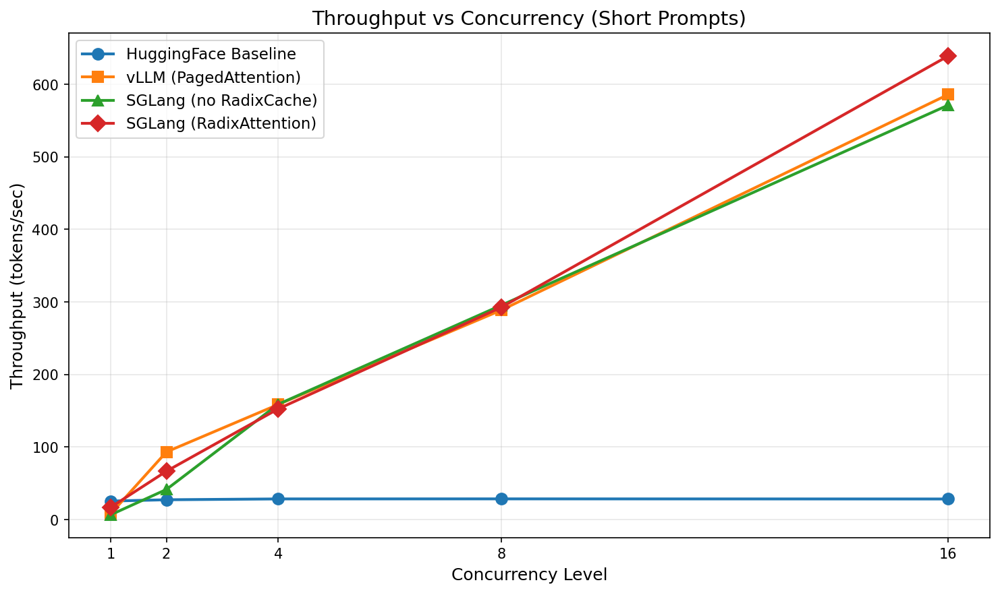
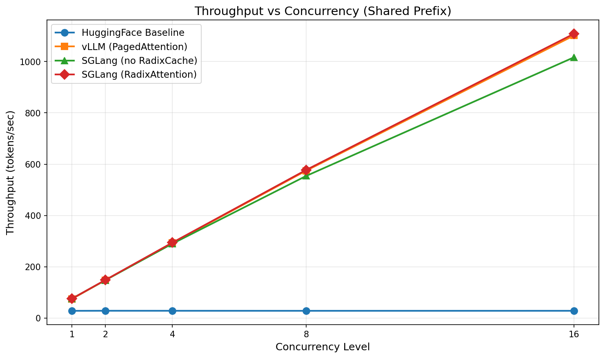
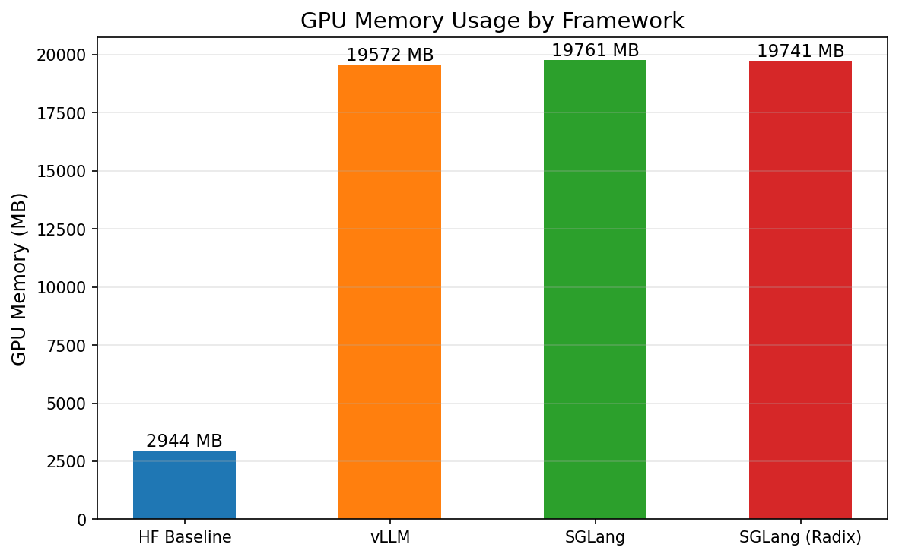

# HPML Final Project: Benchmarking and Profiling High-Throughput Serving Frameworks for LLMs

> **Course:** High Performance Machine Learning  
> **Semester:** Spring 2026  
> **Instructor:** Dr. Kaoutar El Maghraoui

---

## Team Information

- **Team Name:** LLM Serving Benchmark
- **Members:**
  - Yimeng Ye (yy3608) - benchmarking pipeline, experiment execution
  - Can Yang (cy2811) - serving framework integration, analysis
  - Yuxuan Wang (yw4609) - profiling and visualization
  - Jiawei Wang (jw4807) - model/configuration sweep, results validation
  - Zhijing Wu (zw3155) - report, experiment tracking, documentation

## Submission

- **GitHub repository:** [https://github.com/lennonYe/6998_project](https://github.com/lennonYe/6998_project)
- **Final report:** [`deliverables/HPML_Final_Report.pdf`](deliverables/HPML_Final_Report.pdf)
- **Final presentation:** [`deliverables/HPML_Final_Presentation.pptx`](deliverables/HPML_Final_Presentation.pptx)
- **Experiment-tracking dashboard:** [Weights & Biases project](https://wandb.ai/shvpz8ctzd-1/llm-serving-benchmark)
- **Representative run:** [Qwen2.5-1.5B-FP16](https://wandb.ai/shvpz8ctzd-1/llm-serving-benchmark/runs/oscrou8i)

Each model and quantization configuration produces its own WandB run, tagged with the experiment label.

---

## 1. Problem Statement

This project studies the inference-serving bottleneck for autoregressive large language models under concurrent request loads. We compare a plain HuggingFace Transformers baseline against optimized LLM serving frameworks, vLLM and SGLang, to understand how serving-specific KV-cache management and prefix reuse affect latency, throughput, and GPU memory use. The target workload is inference, and the main bottlenecks are GPU memory management, attention/KV-cache efficiency, and scheduling under concurrent generation.

---

## 2. Model/Application Description

- **Model architectures:** Qwen2.5-1.5B-Instruct, Qwen2.5-3B-Instruct, Llama-3.2-1B-Instruct, and Qwen2.5-1.5B-Instruct-AWQ.
- **Frameworks:** HuggingFace Transformers baseline, vLLM with PagedAttention, and SGLang with and without RadixAttention/RadixCache.
- **Dataset/workload:** Synthetic but controlled prompt sets for serving benchmarks:
  - short, independent Q&A prompts;
  - long code-analysis prompts sharing a common prefix to stress prefix caching.
- **Custom modifications:** No model architecture changes. The project modifies the serving/evaluation stack by launching framework-specific servers, issuing concurrent OpenAI-compatible streaming requests, and recording common metrics across frameworks.
- **Hardware target:** Experiments in this branch are configured for NVIDIA L4 24 GB. Earlier mid-report numbers were collected on NVIDIA L40S 48 GB; lower L4 throughput is expected because of lower FP16 compute capability.

---

## 3. Final Results Summary

Representative results below use `Qwen2.5-1.5B-FP16` at concurrency 16 on the L4 rerun. Full JSON results and figures are stored under `results/`.

| Metric | HuggingFace Baseline | vLLM | SGLang | Best Improvement |
| --- | ---: | ---: | ---: | ---: |
| Short-prompt throughput | 28.45 tok/s | 585.90 tok/s | 571.23 tok/s | 20.6x higher with vLLM |
| Shared-prefix throughput | 28.34 tok/s | 1101.40 tok/s | 1108.39 tok/s | 39.1x higher with SGLang RadixAttention |
| Short-prompt average latency | 8999.43 ms | 2044.90 ms | 2396.04 ms | 4.4x lower with vLLM |
| Shared-prefix TTFT | 39.19 ms | 81.89 ms | 63.93 ms | SGLang lowest among serving frameworks |
| GPU memory during serving | 2944 MB model load | 19572 MB | 19741 MB | Baseline uses less memory but much lower throughput |

**Hardware:** 1x NVIDIA L4 24 GB, CUDA-enabled PyTorch/Transformers, vLLM, and SGLang environments.

**Headline result:** Optimized serving frameworks increased concurrency-16 throughput from 28.34 tok/s with the HuggingFace baseline to 1108.39 tok/s with SGLang RadixAttention on shared-prefix prompts, a 39.1x throughput improvement on a single NVIDIA L4.

---

## 4. Repository Structure

```text
.
|-- README.md
|-- .env.example
|-- LICENSE
|-- requirements.txt
|-- configs/
|   |-- __init__.py
|   `-- config.py                # Shared model, prompt, concurrency, and generation config
|-- scripts/
|   |-- run_all.sh               # Full single-model benchmark pipeline
|   |-- run_all_models.sh        # Multi-model and quantization sweep
|   |-- run_single.sh            # Individual benchmark entry point
|   `-- tips.txt                 # Operational notes
|-- src/
|   |-- bench_baseline.py        # HuggingFace baseline benchmark
|   |-- bench_vllm.py            # vLLM server benchmark
|   |-- bench_sglang.py          # SGLang benchmark with/without RadixAttention
|   |-- bench_profile.py         # PyTorch profiler for baseline path
|   `-- visualize.py             # Chart generation and WandB upload
|-- deliverables/
|   |-- HPML_Final_Report.pdf
|   `-- HPML_Final_Presentation.pptx
`-- results/
    |-- Qwen2.5-1.5B-FP16/
    |-- Qwen2.5-3B-FP16/
    |-- Llama-3.2-1B-FP16/
    |-- Qwen2.5-1.5B-AWQ-INT4/
    |-- figures/
    `-- profiler/
```

---

## 5. Reproducibility Instructions

### A. Environment Setup

The serving frameworks have conflicting dependency requirements, so this project uses three separate Python virtual environments.
`requirements.txt` records the pinned package versions used for the reported experiments; install the framework-specific subset in each environment as shown below.

```bash
git clone https://github.com/lennonYe/6998_project.git
cd 6998_project

mkdir -p ~/yym_self_project/envs
for env in env_baseline env_vllm env_sglang; do
    python3 -m venv ~/yym_self_project/envs/$env
done

source ~/yym_self_project/envs/env_baseline/bin/activate
pip install torch==2.6.0 transformers==4.51.3 accelerate==1.6.0 bitsandbytes==0.45.5 matplotlib==3.10.1 wandb==0.19.9 aiohttp==3.11.18 requests==2.32.3
deactivate

source ~/yym_self_project/envs/env_vllm/bin/activate
pip install vllm==0.8.4 aiohttp==3.11.18 requests==2.32.3
deactivate

source ~/yym_self_project/envs/env_sglang/bin/activate
pip install "sglang[all]==0.4.6.post5" aiohttp==3.11.18 requests==2.32.3
deactivate
```

**System requirements:** Python 3.10+, CUDA-capable GPU, NVIDIA driver with `nvidia-smi`, and at least 24 GB GPU memory for the L4 configuration.

### B. Secrets and Authentication

Copy `.env.example` to `.env` and fill in the required keys.

```bash
cp .env.example .env
# Edit .env to add WANDB_API_KEY and HF_TOKEN.

set -a && source .env && set +a
wandb login "$WANDB_API_KEY"
huggingface-cli login --token "$HF_TOKEN"
```

The Hugging Face token is required for gated models such as Llama-3.2.

### C. Experiment Tracking Dashboard

Public experiment tracking is hosted on Weights & Biases:

> **Dashboard:** [https://wandb.ai/shvpz8ctzd-1/llm-serving-benchmark](https://wandb.ai/shvpz8ctzd-1/llm-serving-benchmark)  
> **Platform used:** Weights & Biases

The dashboard contains per-concurrency metrics, summary metrics at concurrency 16, and uploaded comparison figures.

### D. Running Benchmarks

Run the full default single-model pipeline:

```bash
./scripts/run_all.sh
```

Run an individual component:

```bash
./scripts/run_single.sh baseline
./scripts/run_single.sh vllm
./scripts/run_single.sh sglang
./scripts/run_single.sh sglang-radix
./scripts/run_single.sh sglang-noradix
./scripts/run_single.sh profile
./scripts/run_single.sh visualize
```

Run the full multi-model sweep:

```bash
./scripts/run_all_models.sh
```

Override the model or environment directory:

```bash
MODEL=meta-llama/Llama-3.2-1B-Instruct ./scripts/run_single.sh vllm
ENV_DIR=/path/to/envs ./scripts/run_single.sh baseline
```

### E. Profiling

The profiler instruments the HuggingFace baseline path and exports both a Chrome trace and a CSV table of top kernels.

```bash
./scripts/run_single.sh profile
```

Outputs:

- `results/profiler/baseline_trace.json`
- `results/profiler/baseline_top_kernels.csv`

### F. Quickstart: Reproduce the Headline Result

The sequence below reproduces the main benchmark comparison for the default Qwen2.5-1.5B model.

```bash
./scripts/run_all.sh
./scripts/run_single.sh visualize
```

The generated result files appear in `results/`, and figures appear in `results/figures/`.

---

## 6. Results and Observations

- vLLM and SGLang substantially outperform the plain HuggingFace baseline under concurrent serving because they batch and schedule requests through serving-optimized runtimes rather than running requests sequentially.
- vLLM improves short-prompt concurrency-16 throughput from 28.45 tok/s to 585.90 tok/s for Qwen2.5-1.5B-FP16.
- SGLang with RadixAttention is strongest on shared-prefix prompts, reaching 1108.39 tok/s at concurrency 16 for Qwen2.5-1.5B-FP16.
- The shared-prefix benchmark validates the benefit of prefix caching: requests with a common code-analysis prefix can reuse prefix computation instead of repeating the same prefill work.
- The optimized serving frameworks use much more reserved GPU memory than the baseline, which is expected because they preallocate memory for KV cache and request scheduling.
- AWQ INT4 results are included for Qwen2.5-1.5B to study quantized serving behavior; the HuggingFace FP16 baseline is kept separate for a fair unquantized baseline.

Representative figures:







---

## 7. Notes

- All benchmark configuration lives in `configs/config.py`.
- Shell entry points live in `scripts/`; benchmark implementations live in `src/`.
- Server logs are written under `results/`.
- Secrets are loaded from `.env`; do not commit API keys or Hugging Face tokens.
- Large model weights are downloaded from Hugging Face and are not committed to this repository.

### AI Use Disclosure

Per the HPML AI Use Policy, this section documents AI assistance used for the project.

**Did your team use any AI tool in completing this project?**

- [ ] No, we did not use any AI tool.
- [x] Yes, we used AI assistance as described below.

**Tool(s) used:** ChatGPT/Codex.

**Specific purpose:** Drafted and revised README documentation from the HPML README template; helped summarize repository structure and benchmark behavior.

**Sections affected:** README sections 1-7.

**How we verified correctness:** The README content was checked against the repository scripts, configuration files, existing result JSON files, and generated figures.

By submitting this project, the team confirms that the analysis, interpretations, and conclusions are our own, and that any AI assistance is fully disclosed above.

### License

Released under the MIT License. See `LICENSE` if present in the repository.

### Citation

If you build on this work, please cite:

```bibtex
@misc{llmservingbenchmark2026hpml,
  title  = {Benchmarking and Profiling High-Throughput Serving Frameworks for LLMs},
  author = {Ye, Yimeng and Yang, Can and Wang, Yuxuan and Wang, Jiawei and Wu, Zhijing},
  year   = {2026},
  note   = {HPML Spring 2026 Final Project, Columbia University},
  url    = {https://github.com/lennonYe/6998_project}
}
```

### Contact

Open a GitHub issue at [https://github.com/lennonYe/6998_project](https://github.com/lennonYe/6998_project).

---

*HPML Spring 2026 - Dr. Kaoutar El Maghraoui - Columbia University*
